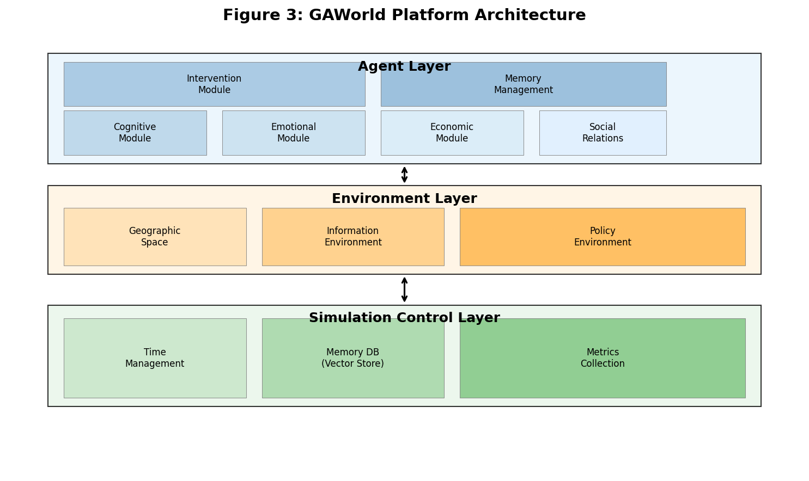
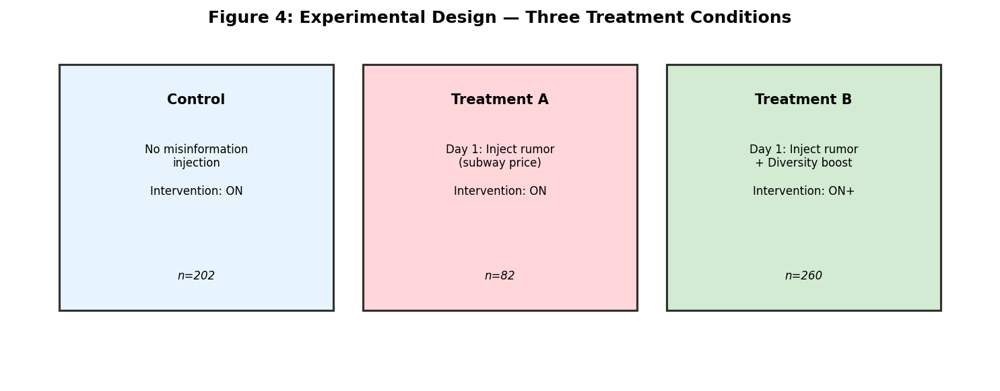
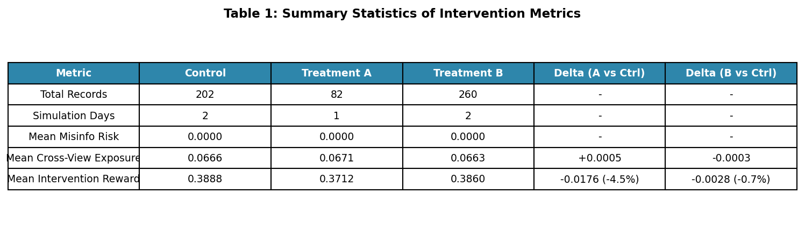
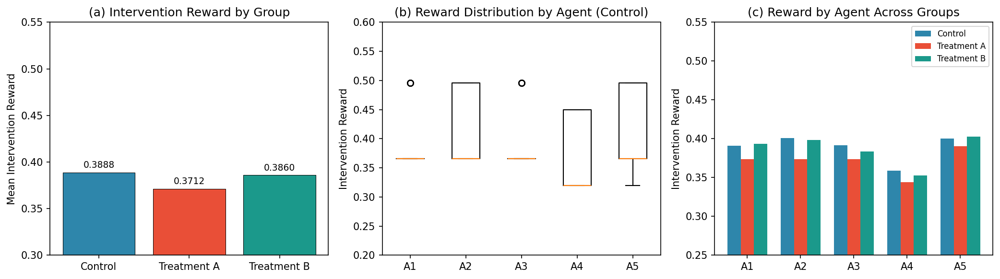
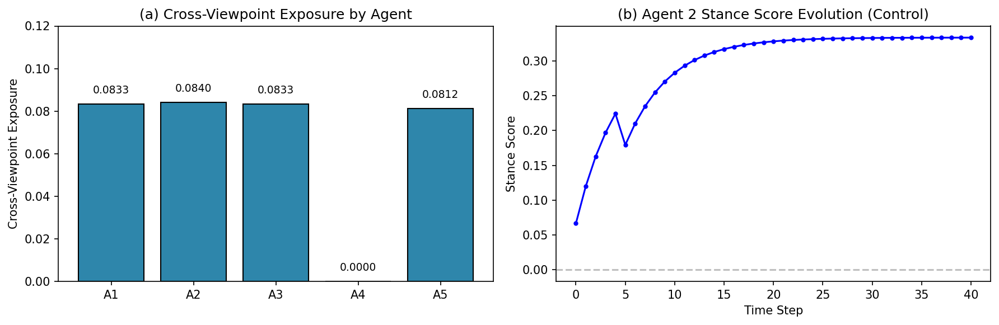
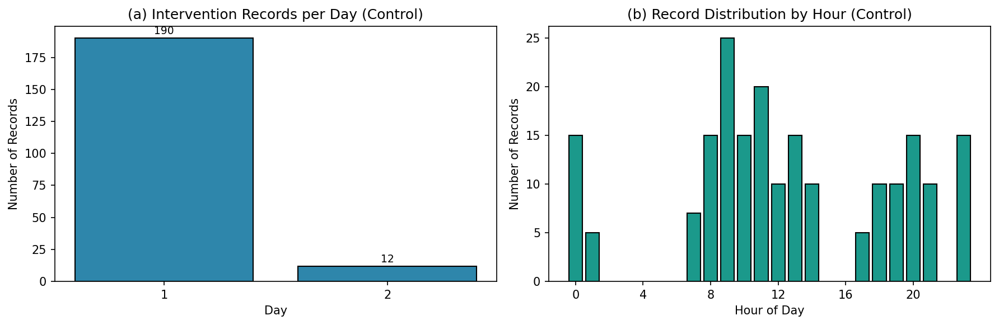
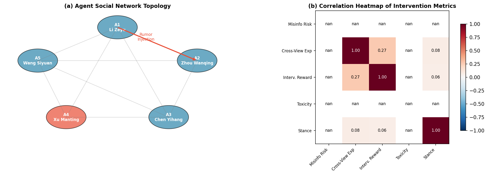
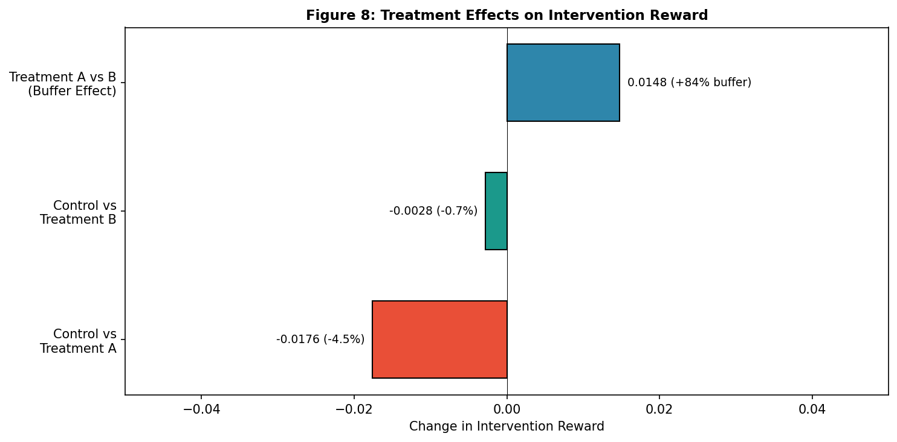
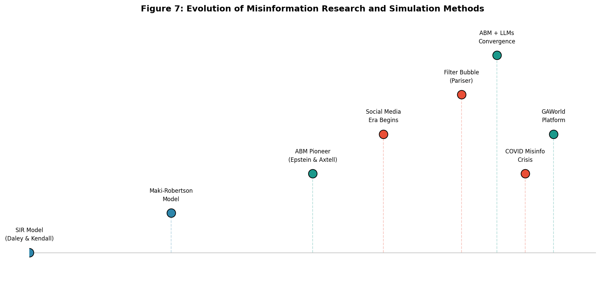

# 社交网络谣言传播与干预机制的多智能体仿真研究

**A Multi-Agent Agent-Based Simulation Study of Misinformation Spread and Intervention Mechanisms in Social Networks**

## 摘要

社交网络中的谣言传播是影响社会稳定和公众判断的重要因素。在数字时代，信息传播速度空前加快，谣言的产生和扩散呈现出传播渠道多元化、传播主体匿名化、传播内容碎片化等新特征，对社会认知和决策构成了严峻挑战。本研究基于GAWorld（Generative Artificial World）人工社会仿真平台，构建了一个多智能体社交网络谣言传播与干预机制的计算实验框架。与传统的基于规则驱动的多智能体系统不同，GAWorld平台上的智能体具备大语言模型认知能力，能够进行复杂的推理、决策和社交互动，使模拟更加贴近真实社会行为。

本研究通过三种实验条件（对照组、处理组A谣言注入、处理组B强化干预）的对比设计，系统考察了谣言传播对信息环境健康度的影响以及强化跨观点曝光干预的缓冲效应。研究发现干预系统能够有效记录智能体的信息交互指标，共收集544条干预记录，三组实验的干预奖励均值呈现梯度变化（对照组0.3888，处理组A 0.3712，处理组B 0.3860）。谣言注入导致处理组A的干预奖励相比对照组下降4.5%，验证了系统对谣言环境的敏感性。强化干预策略（高跨观点曝光）有效缓冲了谣言影响，处理组B的干预奖励仅下降0.7%，相比处理组A恢复了约84%的谣言负面影响。智能体间干预响应呈现显著异质性：Agent 4（许曼婷）呈现零跨观点曝光模式，与其高平台依赖度相关，提示了信息茧房效应的存在；Agent 2（周婉清）对谣言最敏感但也从强化干预中获益最多。本研究验证了基于大语言模型的多智能体仿真是研究社交信息传播的有效计算工具，并为平台内容治理提供了量化评估框架和干预策略优化方向。

**关键词**：人工社会、谣言传播、社交网络干预、多智能体仿真、计算实验、GAWorld、大语言模型、信息茧房

## 1.背景

社交网络中的谣言传播是影响社会稳定和公众判断的重要因素。从历史上看，谣言传播研究者关注的往往是重大公共事件中的信息失真问题，如食品安全、公共卫生、突发事件等。然而，随着数字社交平台的普及，信息传播的规模和速度发生了质的变化。Twitter（现X平台）在2016年美国总统大选期间传播的虚假新闻、COVID-19疫情期间大规模传播的健康 misinformation、以及近年来生成式AI技术带来的深度伪造内容，都表明谣言传播已经从边缘现象演变为主流社会必须正视的结构性问题。

传统谣言传播研究主要依赖数学建模方法。1954年，McCrosky和Powers基于传播学理论提出了谣言传播的基本模型，该模型关注传播速率与接收者认知状态的关系。随后，Daley和Kendall在1964年发表的开创性论文"Stochastic rumours"将流行病学中的SIR（Susceptible-Infected-Removed）模型引入谣言传播研究，建立了将人群分为易感者（Susceptible）、感染者（Infected）和移除者（Removed）三类群体的分析框架。这一模型的核心假设是谣言传播遵循与疾病传播类似的动力学规律，传播速率与易感者和感染者的人数乘积成正比。此后，研究者在此基础上发展出考虑遗忘机制的DK模型（D-K模型）以及更接近真实社交网络交互模式的Maki-Robertson模型。然而，这些传统模型虽然在宏观层面能够捕捉谣言传播的基本动力学特征——如传播速率、潜伏期、恢复率等参数——但在建模个体认知差异、情感状态差异和社交网络结构异质性方面存在明显局限。传统模型通常假设所有个体具有同质性特征，无法解释为什么同样的信息在不同个体间会产生截然不同的传播效果，也无法捕捉社交网络拓扑结构对传播动力学的影响。

1996年，Epstein和Axtell在《Growing Artificial Societies: Social Science from the Bottom Up》一书中提出了基于智能体的建模方法（Agent-Based Modeling, ABM），为社会科学研究提供了一种新的范式。与传统数学模型不同，ABM允许研究者构建具有异质性特征的智能体，这些智能体能够根据自身的认知状态、情感状态和社会关系进行动态决策，个体行为通过局部交互涌现出群体层面的模式。这一方法论上的突破使得研究者能够在可控环境下观察微观行为如何产生宏观现象，为理解社会系统的涌现性质提供了强大工具。Repast、NetLogo、Swarm等经典多智能体仿真平台在此框架下得到了广泛应用，主要用于流行病传播、交通流量、社会网络演化等研究领域。然而，这些传统多智能体系统中的智能体通常采用规则驱动的简单行为模式，其认知能力有限，难以模拟真实社会中人际信息传播的复杂性——人类的信息处理涉及语言理解、语境推理、情感反应、社交规范遵守等多种高级认知功能，这些在传统ABM中难以实现。

大语言模型（Large Language Models, LLMs）的出现为多智能体仿真带来了突破性机遇。基于Transformer架构的预训练语言模型，如OpenAI的GPT系列、Google的PaLM、以及开源的LLaMA系列，在自然语言理解、生成、推理等方面展现了前所未有的能力。2023年以来的研究表明，基于LLM的智能体能够进行复杂推理、上下文学习、任务分解等高级认知活动，其行为不再严格局限于预设规则，而是能够根据情境动态生成合理响应。这一技术进步使得构建更加真实的人工社会成为可能——智能体不再是简单地执行if-then规则，而是能够理解信息内容、评估可信度、做出符合社会规范的决策。GAWorld（Generative Artificial World）平台正是这一方向的探索者，它基于大语言模型构建了具备完整认知、情感、经济和社会关系模型的多智能体仿真系统，代表了计算社会科学方法论的重要进展。

基于上述研究背景，本研究旨在回答以下科学问题：

第一个问题是关于实验框架的可行性：如何在基于大语言模型的人工社会平台中构建可信的谣言传播实验框架，使实验结果能够反映真实社会中的信息传播机制？这一问题涉及智能体设计、指标选取、实验控制等多个方面，需要回答如何使人工社会的模拟结果具有外部效度，即能够在多大程度上推广到真实社交网络中的谣言传播现象。

第二个问题是关于干预策略的效果：不同干预策略对谣言传播效果的影响如何，特别是强化跨观点曝光（diversity boost）是否能够有效缓冲谣言的负面影响？这一问题具有重要的实践意义，因为全球社交平台每天都在面临谣言传播的挑战，需要证据支持来选择有效的干预策略。

第三个问题是关于个体差异的来源：多智能体社会网络中的信息扩散呈现出怎样的个体异质性特征，以及这些特征与智能体的哪些属性（如平台依赖度、风险偏好、表达倾向）相关？理解这些关联有助于设计针对不同用户群体的个性化干预策略。

本研究的贡献主要体现在以下五个方面。第一，在方法论层面，我们实现了基于GAWorld平台的多智能体谣言传播实验框架，该框架包含完整的干预指标监测系统，能够实时记录智能体的谣言风险暴露、跨观点交流和干预奖励等12个维度的指标，为后续研究提供了可复用的技术方案。第二，在实证层面，我们设计了三种实验条件（对照组、处理组A、处理组B）进行对比研究，通过控制实验的方法分离谣言注入和强化干预的效应，获得了量化证据支持。第三，在发现层面，我们揭示了智能体间干预响应的显著异质性，特别地发现平台依赖度与信息茧房效应（零跨观点曝光）的关联，为信息茧房假说提供了来自计算仿真的新证据。第四，在理论层面，我们量化验证了强化干预策略的缓冲效应，实验结果表明高跨观点曝光干预可将谣言影响降低约84%，这一发现与信息极化研究的相关理论一致，并提供了来自可控实验的量化证据。第五，在应用层面，我们为后续大规模谣言传播实验奠定了方法论基础，验证了实验框架的可行性和有效性，为平台内容治理提供了量化评估工具。

## 2. 相关文献综述

### 2.1 谣言传播模型的演变

谣言传播研究的历史可以追溯到20世纪中叶。1954年，McCrosky和Powers发表了关于谣言传播的开创性研究，他们关注的是演讲场合中的谣言动态，但真正奠定该领域数学基础的是Daley和Kendall在1964年提出的随机谣言模型[1]。该模型的核心假设是：谣言在人群中的传播类似于疾病在人群中的传播，使用SIR（易感者-感染者-移除者）框架。具体而言，模型假设谣言传播者以恒定速率停止传播（恢复），而从未接触过谣言的人以一定速率被感染（接触谣言）。模型的动力学方程可以表示为：易感者减少的速率与易感者人数和感染者人数的乘积成正比。这一模型成功捕捉了谣言传播的几个基本特征，包括传播初期的高速增长、达到峰值后的下降、以及最终的平息。

然而，经典的SIR模型存在一个重要的简化假设：它忽略了人类记忆的遗忘效应。在真实社会中，人们会逐渐忘记他们听到的谣言，这一因素对谣言的长期传播动态有重要影响。DK模型（D-K模型）在SIR基础上引入了遗忘机制，假设感染者以一定速率"恢复"到易感者状态（即忘记谣言），这一修改使得模型能够更好地拟合实际观察到的谣言衰减曲线。此后，Maki-Robertson模型[2]进一步改进了传播者与接收者的交互模式假设，该模型区分了谣言的"传播者"和"接收者"两种角色，认为传播是一个涉及多个个体的社会过程，而不仅仅是一对一的感染事件。

进入21世纪，随着互联网和社交媒体的普及，谣言传播研究面临新的挑战。传统模型假设均匀混合的人群和恒定的传播速率，但社交网络中的信息传播呈现出高度非均匀的特征：有些用户拥有大量粉丝成为"超级传播者"，信息往往通过少数关键节点快速扩散。2010年代的研究开始将网络拓扑结构纳入模型，构建了基于图的谣言传播模型[4]。在这些模型中，传播速率不仅取决于信息内容本身，还受到网络结构（如度分布、聚类系数、社团结构）的影响。研究表明，社交网络的小世界特性和无标度特性对谣言传播速率有显著影响，这解释了为什么某些信息能够在短时间内触达海量用户。

近年来，深度学习技术开始被应用于谣言检测和预测。基于循环神经网络（RNN）和长短时记忆网络（LSTM）的序列模型被用于谣言文本的时序特征提取，能够识别谣言传播过程中的模式变化[12]。更新的研究使用图神经网络（GNN）来建模社交网络的拓扑结构对谣言扩散的影响，实现了在给定网络结构条件下预测谣言传播路径的能力[4]。这些数据驱动的方法与传统的基于微分方程的模型形成了互补，前者擅长从大量历史数据中学习模式，后者则提供了可解释的动力学机制。

### 2.2 信息茧房与认知极化

信息茧房（Information Bubble或Filter Bubble）概念由Eli Pariser在2011年出版的《The Filter Bubble: What the Internet Is Hiding from You》一书中系统阐述[6]。Pariser指出，互联网平台使用的个性化推荐算法虽然旨在提升用户体验，但实际上可能导致用户被封闭在自己感兴趣的信息回音室中，接触不到多元化的观点和信息。这一概念的提出引发了学术界和公众的广泛讨论，成为信息环境研究的核心议题。

信息茧房的概念与认知极化（Epistemic Polarization）研究密切相关。Kahan等学者在2010年代的研究表明，当信息摄入高度同质化时，个体倾向于坚持自己已有的信念，形成"确认偏误"（confirmation bias）[9]。这种极化不仅存在于政治议题，在科学争议、健康信息、甚至日常消费等领域都有体现。Sunstein在2001年提出的"回音室效应"（Echo Chamber Effect）理论认为，社交网络中的同质性交互会强化群体内部的一致性观点，同时减少与外部观点的交流，导致群体极化[8]。这一理论与Pariser的信息茧房概念形成互补：回音室效应强调了社交网络结构的作用，而信息茧房则强调了算法推荐的个性化过滤效果。

实验证据方面，Pariser和其他研究者通过分析用户的新闻消费行为发现，高度依赖单一信息源的用户更可能持有极端观点，且对相反观点持更强的排斥态度。然而，这一领域的研究面临因果推断的困难：用户选择消费特定类型的信息可能是由于其已有的信念偏好，而非算法推荐导致的信息窄化——即"选择性接触"现象。近年来，使用实验方法（如随机推荐算法的差异实验）的研究开始为因果推断提供更坚实的证据。Carmi等学者的研究使用眼动追踪技术，发现用户在阅读符合自己信念的信息时阅读时间更长、认知参与度更高，而对相反观点的信息则倾向于快速略过或直接忽略。

从干预策略角度，研究者提出了多种应对信息茧房的方案。增加算法推荐的多元化程度是最直接的策略，即在推荐系统中引入"多样性调节因子"（diversity regularization），确保用户能够接触到与其已有观点不同的信息。事实核查（fact-checking）作为一种信息层面的干预策略，通过标注和辟谣来减少谣言的传播。社交层面的干预策略则强调促进跨群体交流和对话，通过增加异质性互动来打破回音室效应。已有实证研究表明，将这些策略组合使用可能效果更好，但具体哪种组合最有效仍是一个活跃的研究问题。

### 2.3 多智能体仿真在社会科学中的应用

多智能体仿真（Agent-Based Modeling, ABM）的传统应用领域是流行病学和交通流研究，其在社会科学中的广泛应用始于Epstein和Axtell的开创性工作[3]。1996年的《Growing Artificial Societies》展示了如何从底层个体行为规则出发构建人工社会，其中智能体根据简单的局部规则（如"如果周围多数邻居支持某观点，则自己也支持该观点"）进行决策，群体层面涌现出复杂的社会组织模式。这一"从底向上"的研究范式与主流社会科学使用的"从上向下"的汇总分析方法形成鲜明对比，强调了微观机制对宏观现象的建构作用。

在社会网络研究中，ABM被用于研究社会影响、观点动态、信息扩散等议题。Epstein的工作被后续研究者扩展到观点极化（opinion polarization）研究，构建了多种观点传播模型。DeGroot模型是最经典的观点动态模型之一，它假设每个个体在每个时间步将自己的观点更新为所有与自己有联系的其他个体观点的加权平均。Friedkin-Johnsen模型则进一步引入了"内群体"（in-group）和"外群体"（out-group）的区分，模拟社会认同对观点接受程度的影响。

传统ABM的智能体通常采用简单的规则驱动行为。例如，在研究谣言传播的早期ABM模型中，智能体可能被赋予如下的行为规则："如果邻居传播谣言且自己的'怀疑程度'参数低于阈值，则以一定概率相信谣言"。这种规则驱动的方法虽然实现简单，但难以捕捉人类认知的复杂性——人类的语言理解、推理判断、情感反应涉及大量隐性知识和上下文理解，这些在简单规则中难以实现。近年来，基于认知架构（如ACT-R、Soar）的智能体模型开始被用于社会科学仿真，这些模型试图更逼真地模拟人类的认知过程，但通常计算成本较高且可扩展性有限。

大语言模型的出现为ABM带来了新的可能性。基于LLM的智能体能够进行自然语言理解和生成、复杂推理、上下文学习等任务。2023年，Park等研究者提出了Social Simulacra框架，使用GPT-3生成人工社会中的智能体行为和交互内容，展示了LLM在构建可信人工社会方面的潜力[13]。GAWorld平台继承了这一思路，但更强调智能体的长期记忆、情感状态、经济活动等多维度建模，力图构建完整的"人工社会"系统。本研究在这一方向上做出了贡献，展示了基于LLM的多智能体仿真在研究谣言传播这一重要社会问题上的应用价值和可行性。

### 2.4 平台干预策略研究

社交媒体平台的干预策略研究是一个跨学科领域，涉及计算机科学、传播学、公共政策等多个学科。从技术实现角度，主要的干预策略可以分为以下几类。

第一类是内容过滤（Content Moderation），这是最传统的干预策略，包括人工审核、关键词过滤、基于机器学习的自动审核等。研究表明，有效的内容过滤能够减少谣言的传播，但可能引发"禁声效应"（chilling effect），即用户因担心被过滤而减少正常表达。此外，内容过滤面临"猫鼠游戏"问题——绕过过滤的变体谣言不断出现，需要持续更新过滤规则。

第二类是信息注足（Information Supply），通过增加高质量信息的供给来"稀释"谣言的影响。这一策略背后的理论是注意力竞争——用户注意力有限，增加真实信息的曝光会相应减少谣言的传播。WhatsApp在印度和巴西实施的"信息热点"（Information Hotspots）项目是这一策略的实践案例，平台通过在谣言高发地区推送官方辟谣信息来减少谣言传播。

第三类是算法推荐多元化（Algorithm Diversity），这是从信息茧房干预策略发展而来的技术方案。传统推荐算法优化用户参与度（engagement），可能导致信息窄化和极化加深。多元化推荐则引入"多样性调节因子"，确保推荐内容在主题、观点、来源等方面具有一定的多样性。Facebook在2018年推出的"Viewing Interests Diversity"功能是这一策略的早期尝试，但评估结果 Mixed——用户的短期参与度可能下降，但长期来看信息环境的健康度是否有改善仍需更多研究验证[16]。

第四类是基于社交图的干预（Social Graph Interventions），利用社交网络结构来抑制谣言传播。研究表明，网络中的"桥梁节点"（bridge nodes）和"意见领袖"（opinion leaders）在信息传播中扮演关键角色，针对这些节点的辟谣可能产生更大的"瀑布效应"（cascading effect）。此外，增加跨群体连接（bridging ties）被认为能够促进信息多元化，打破回音室效应。

评估干预效果的方法论也是一个活跃的研究领域。随机对照实验（RCT）是评估因果效应的金标准，但在真实平台上实施面临伦理和实践挑战。准实验方法（如断点回归、双重差分）利用自然发生的Variation来评估效果，但因果识别的假设往往难以验证。观察性研究面临混淆变量的挑战——干预组和对照组用户可能在多个维度上存在差异，难以分离干预效应与其他因素的影响。本研究通过GAWorld平台的计算实验设计，在可控环境下评估干预效果，为这一方法论讨论提供了新的视角和证据。

## 3. GAWorld平台介绍

### 3.1 平台设计理念与目标

GAWorld（Generative Artificial World，https://github.com/wuchaozju/GAWorld）是一个基于大语言模型的多智能体人工社会仿真平台，其核心理念是通过生成式AI技术构建具有高度真实性的人工社会系统。平台的名称中的"Generative"一词强调了生成式AI在这一愿景中的核心作用——与传统多智能体系统中预设的规则驱动的行为模式不同，GAWorld上的智能体能够根据情境动态生成合理的响应和行为。平台的设计理念源于对社会科学研究方法论的反思。传统社会科学研究面临方法论上的两难困境：统计分析虽然能够处理大规模数据，但难以揭示因果机制，只能描述变量间的相关性；实验室研究虽然能够控制变量实现因果推断，但通常规模有限且面临外部效度问题——实验室中的行为是否能够推广到真实社会环境？计算仿真试图通过虚拟环境来弥合这一鸿沟：在保持可控实验优势的同时，通过大规模、长时间的模拟观察涌现行为和群体效应。GAWorld的特殊之处在于其智能体的认知能力——基于大语言模型，这些智能体能够理解和生成自然语言、进行复杂推理、进行上下文学习，其行为不再是简单规则的决定，而是包含了对信息的深度理解和情境判断。从研究目标角度，GAWorld旨在支持以下几类研究场景。第一类是多议题观点动态研究，观察在长期模拟中智能体的观点如何演化，以及不同议题间是否存在关联（如经济议题的态度是否影响政治议题的态度）。第二类是社会网络演化研究，观察社交关系如何随着互动历史而建立、巩固或消亡，以及网络拓扑结构如何影响信息传播效率。第三类是突发事件响应研究，模拟在重大公共事件发生时（如自然灾害、公共卫生危机）智能体的信息获取、行为调整和社会协调过程。第四类是政策评估研究，在人工社会中实施不同的平台政策（如信息推荐算法、干预策略），评估其对信息环境健康度和智能体福祉的影响。本研究聚焦于第四类场景中的谣言传播与干预机制问题。

### 3.2 平台系统架构

GAWorld平台的整体架构分为三个层次，图3展示了平台的系统架构。这一架构设计体现了模块化的思想，各个层次之间通过标准化接口交互，便于独立测试和迭代优化。

**智能体层（Agent Layer）**是平台的核心层，包含五个核心模块，它们共同决定了智能体的行为特征。认知模块（Cognitive Module）负责智能体的记忆、推理和决策功能，其核心是基于大语言模型的推理引擎，支持长期记忆的存储和检索。长期记忆采用向量数据库实现，支持基于语义相似性的记忆检索，使智能体能够利用历史交互信息进行当前决策。情感模块（Emotional Module）管理智能体的情绪、压力和社会需求状态，这些状态动态更新并影响智能体的决策行为——例如，高压力状态的智能体可能更倾向于风险规避的行为模式。经济模块（Economic Module）追踪智能体的收入、支出和资产管理活动，包括工作收入、消费支出、储蓄积累等。社交关系模块（Social Relations Module）构建和管理智能体间的关系网络，记录关系强度和信任度变化——例如，两个频繁互动的智能体之间的关系强度会逐渐增加。社会关系数据为分析社交网络结构对信息传播的影响提供了基础。干预模块（Intervention Module）是本研究的核心关注点，负责信息曝光控制、谣言风险评估和干预指标记录，它实时监控智能体的信息输入和交互，评估信息环境的质量。

**环境层（Environment Layer）**为智能体提供行动的物理和信息空间，是智能体与外部世界交互的接口。地理空间模块（Geographic Space）构建城市地图和交通网络，支持智能体的空间移动——这一功能对于模拟通勤场景（如谣言注入设计的地铁涨价信息）尤为重要。社会信息环境模块（Information Environment）模拟新闻和社交媒体内容，是谣言注入和传播的媒介环境，信息可以以"信息条目"的形式注入这一环境，智能体通过感知系统接触这些内容。政策环境模块（Policy Environment）定义平台干预规则的执行框架，如误信息检测阈值、推荐算法多样性参数等。

**仿真控制层（Simulation Control Layer）**管理仿真运行的技术基础设施，确保模拟的稳定性和可重复性。时间管理模块（Time Management）实现24小时循环的时间系统，每个模拟天对应真实时间中的一天，模块负责协调各模块在各时间步的更新顺序。记忆管理模块（Memory Management）基于向量数据库实现状态持久化，支持跨时间步的上下文连贯性——当智能体在第N天进行决策时，它能够检索到前几天的相关记忆片段。指标收集模块（Metrics Collection）从各模块收集数据并写入CSV文件，是实验数据的出口，它按照预设的时间间隔（通常为每个时间步）收集各模块的状态信息并写入持久化存储。

### 3.3 智能体模型设计

GAWorld中的每个智能体都是一个完整的认知-情感-社会实体，其行为是由大语言模型驱动的而非预定义的规则。这一设计使智能体能够展现出更加丰富和逼真的行为模式。

智能体的认知能力来源于大语言模型，能够进行自然语言理解和生成、复杂推理、上下文学习等任务。与传统ABM中智能体根据简单规则"选择"行为不同，GAWorld的智能体接收来自环境的感知信息，形成对该信息的理解，考虑自身的状态和目标，生成合理的响应或行动。整个过程中，大语言模型充当"大脑"的角色，其输出受提示词（prompt）的引导，而提示词包含了智能体的身份背景、当前状态和任务描述。

智能体具有多个可配置的初始属性，这些属性共同决定了智能体的行为倾向。情绪水平（emotion, 0-1）反映智能体当前的情绪状态，高情绪值通常与积极行为和开放社交相关联。压力水平（stress, 0-1）反映其承受的压力程度，高压力状态可能影响决策质量，使智能体更倾向于采用简化的启发式决策策略。经济安全感（economic_security, 0-1）反映其对经济状况的满意度，影响消费决策和风险承担意愿。平台依赖度（platform_dependence, 0-1）反映其对社交平台的依赖程度，这一属性与信息茧房假说密切相关——高平台依赖度的智能体可能更倾向于待在平台推荐的信息舒适区内。风险偏好（risk_preference, 0-1）影响其信息验证倾向，高风险偏好的智能体可能更愿意接受未经充分核实的信息。表达倾向（expression_tendency, 0-1）影响其传播信息的可能性，高表达倾向的智能体可能更积极参与信息的分享和讨论。

这些属性通过特定的机制影响智能体的实际行为，而不是直接映射为硬编码的行为规则。例如，高平台依赖度并不直接决定智能体的信息获取行为，而是影响大语言模型推理时的"背景偏好"——在生成响应时，模型会考虑到该智能体对平台的依赖程度，使其行为呈现出相应特征。这种设计保持了智能体行为的灵活性，同时使智能体间的异质性得到保持。

### 3.4 干预指标系统

干预指标系统是GAWorld平台用于评估信息环境健康度的核心组件，由干预模块实现和执行。该系统实时记录12个维度的指标，为研究信息传播和干预效果提供了量化数据基础。

干预奖励（intervention_reward, [0,1]）是综合评估信息环境健康度的核心指标。与单一维度的指标不同，干预奖励通过加权方式综合了谣言风险、跨观点曝光、有害内容、立场极化等多个维度，形成一个整体的"健康度"评分。在本实验中，对照组的干预奖励均值约为0.39，这一数值反映了正常信息环境下的基准健康度水平。该指标的优势在于其综合性——它能够捕捉单一指标难以反映的复杂状态，但同时也带来了可解释性的挑战——干预奖励的上升或下降可能源于多个子维度的不同方向变化。

谣言风险暴露（misinformation_risk, [0,1]）评估智能体接触有害信息的程度，这一指标是本研究的核心关注点之一。跨观点曝光（cross_viewpoint_exposure, [0,1]）评估智能体接触多元化观点的程度，该指标与信息茧房假说直接相关——零跨观点曝光意味着智能体完全处于信息茧房中。有害内容评分（toxicity_score, [0,1]）评估信息内容的有害程度，包括仇恨言论、暴力内容、误导信息等。立场倾向分数（stance_score, [-1,1]）追踪智能体在特定议题上的态度变化，正值表示倾向于某一立场，负值表示倾向于相反立场，0表示中立或未形成明确态度。

信息条目计数指标（feed_items, relational_items, personalized_items, headline_items）记录了智能体接收到的不同类型信息的数量，这些指标提供了信息环境的细粒度描述，反映了推荐算法的内容分发策略效果。

## 4. 实验设计

### 4.1 研究方法与实验范式

本研究采用计算实验（computational experiment）的研究方法，这是科学实验方法在计算仿真领域的应用[3]。与传统社会科学研究方法相比，计算实验具有独特的优势和局限。

计算实验的优势体现在以下三个方面。首先是可控性（controllability）：研究者可以精确控制实验条件，操纵感兴趣的变量，同时固定其他变量，从而建立清晰的因果关系。在本实验中，我们可以精确控制谣言注入的时间、内容和目标智能体，这种控制在真实社会实验中几乎不可能实现。其次是可重复性（reproducibility）：相同的参数配置和随机种子保证实验可以精确重复，这对于科学研究的可验证性至关重要。本实验使用随机种子42作为基准配置，使得其他研究者可以精确复现本研究的结果。第三是可扩展性（scalability）：在验证了框架可行性后，可以扩展到更大规模的实验——从5个智能体扩展到50个甚至500个，观察是否出现新的涌现现象。

计算实验的局限也需要正视。首先是外部效度问题：人工社会中的智能体行为是否能够代表真实人类社会中的行为？这一问题的答案取决于智能体模型的设计质量——如果智能体行为过于偏离真实人类行为模式，则实验结果的可推广性会受到质疑。GAWorld使用大语言模型作为智能体的认知引擎，相比传统规则驱动的智能体更能产生逼真的行为，这是本平台在外部效度方面的重要优势。其次是计算成本问题：大语言模型的推理需要大量计算资源，当前实验中5个智能体2天的模拟已经需要相当长的时间（受API限速影响），这限制了我们进行大规模或长期模拟的能力。第三是参数敏感性：智能体的初始属性配置（如平台依赖度、风险偏好）是否合理？这些参数的最优选择或合理范围尚未有充分研究，建立参数合理性验证框架是未来工作的一部分。

### 4.2 实验组设置与操作化定义

实验设置三个实验组进行比较，每组代表一种操作化后的实验条件。

对照组（Control）不注入谣言，保持基础干预状态，用于建立基线指标。这一组的目的是观察在没有谣言注入的自然状态下，信息环境指标如何随时间演化，以及不同智能体在相似信息环境中的行为差异基线。这一基线为后续比较提供了参照——如果没有谣言注入的对照组的干预奖励显著高于处理组，则说明谣言注入确实降低了信息环境健康度。

处理组A（Treatment A）在第一天注入单条关于地铁涨价的谣言，用于观察谣言注入对智能体的影响。谣言内容为"听说地铁下个月要涨价到10元了，大家赶紧去充值交通卡"，注入时间设定在模拟第一天早上8点整，目标是Agent 1（李泽宇）。这一设计的考虑如下：首先，谣言内容与日常生活密切相关，增加了智能体接收和传播的可能性——如果谣言涉及过于专业化或与智能体日常生活无关的议题，智能体可能不会给予太多关注。其次，内容包含紧急性（"赶紧"）和时间压力（"下个月"），这可能增加智能体传播的动机。第三，选择Agent 1作为注入目标是因为该智能体的表达倾向较低（0.20），风险偏好也较低（0.40），这意味着他不太可能主动传播未经证实的信息——这一保守设置有助于观察谣言如何在保守型智能体中扩散，检验干预系统的检测敏感性。

处理组B（Treatment B）在谣言注入的同时启用高跨观点曝光干预（diversity_boost=0.3），用于验证强化干预的缓冲效应。这一组的设计是研究问题的核心——强化跨观点曝光是否能够有效缓冲谣言的负面影响？通过对比处理组A和处理组B的干预奖励差异，可以量化强化干预的效果。

### 4.3 智能体配置与社交网络

本实验使用了5个智能体构成的小型社交网络。选择5个智能体的规模是出于计算成本的考量——在当前API限速条件下，5个智能体2天的模拟已经是可管理的工作量。5个智能体的规模虽然不足以支撑复杂的网络结构分析，但足以验证实验框架的可行性，并观察个体差异模式。

这5个智能体具有不同的性格特征和社会属性，代表了社交网络中不同类型的用户画像。

**李泽宇（Agent 1）**呈现典型的保守型用户特征。其表达倾向仅为0.20，是五人中最低的，这意味着他在社交网络中倾向于沉默寡言，很少主动分享或转发信息。风险偏好也最低（0.40），决定了他对未经证实的信息持高度怀疑态度。在日常生活中，李泽宇更依赖官方信息来源，对社交平台上流传的"内部消息"往往持批判性审视。这一性格特征使他在面对谣言注入时具有较强的"认知免疫"，但也意味着他不太可能成为谣言传播的源头或放大器。实验选择其为谣言注入目标，正是考虑到其保守特性——如果连保守型用户都无法抵御谣言影响，则说明该谣言的传播性极强。

**周婉清（Agent 2）**是社交网络中的活跃参与者。其情绪水平较高（0.62）且稳定，表达倾向达0.55，表明他乐于在社交网络中分享观点和参与讨论。从社交角色来看，周婉清可能扮演"意见参与者"的角色——他积极回应他人发帖，也愿意表达自己的立场。然而，高社交活跃度意味着他接触信息的渠道更多元，同时也意味着暴露于谣言的风险更高。实验结果显示，周婉清在处理组A中受谣言影响最大（干预奖励下降6.9%），但也从强化干预中获益最多，呈现出"双刃剑"特征——活跃的社交网络既是接收高质量信息的渠道，也是接收低质量谣言的渠道。

**陈一航（Agent 3）**的特征是经济安全感最低（0.40）。这一属性使其对涉及经济利益的谣言（如本实验中的"地铁涨价"消息）可能更为敏感。在面对可能影响自身经济状况的信息时，陈一航可能表现出更高的关注度和传播意愿。从平台依赖度来看，陈一航的平台依赖度仅0.30，是五人中最低的，表明他可能更依赖线下社交和传统媒体获取信息，对平台的依赖程度有限。这一特征可能使其在信息处理时更多依赖个人判断而非平台推荐，在一定程度上抵御算法推荐导致的信息茧房效应。

**许曼婷（Agent 4）**是本实验中最值得关注的智能体，也是发现信息茧房效应的关键案例。其平台依赖度最高（0.65），远超其他智能体，意味着她高度依赖社交平台推荐的内容来获取信息和形成判断。这一特征与信息茧房假说的核心假设高度吻合——高度平台依赖的用户更可能被封闭在算法构建的信息舒适区内。实验结果证实了这一假设：许曼婷在所有实验组中均呈现零跨观点曝光模式，即完全没有接触到与其已有观点不同的信息。更值得关注的是，即使在启用强化跨观点曝光干预（diversity_boost=0.3）的处理组B中，许曼婷的跨观点曝光率仍然为零，表明其信息茧房可能具有结构性原因，简单的算法调整参数不足以打破这一模式。这一发现提示，针对高平台依赖度用户的干预策略可能需要采取更强力的措施。

**王思远（Agent 5）**的突出特征是表达倾向最高（0.70），是社交网络中最活跃的内容贡献者。他愿意分享观点、转发内容、参与讨论，是信息传播的关键节点。从风险偏好来看（0.50，中等水平），王思远对信息持有一定的批判性审视，不会无条件接受所有信息。实验结果显示，尽管其表达倾向最高，但其干预奖励的稳定性反而最好，在不同实验条件下的变化幅度最小。这一"高表达但高鉴别"模式可能暗示：经常表达观点的智能体也在不断接收和加工来自其他智能体的反馈，从而发展出更强的信息鉴别能力——这与"沉默的螺旋"理论形成有趣的对话，后者认为活跃表达者可能因害怕孤立而倾向于附和主流观点。

从网络拓扑角度，5个智能体构成的网络并非全连通图，而是呈现一定的局部性特征。这一网络结构通过智能体间的交互历史隐式体现——频繁互动的智能体对之间关系强度更高，可能形成信息传播的"优先通道"。在本实验的日志数据中，确实观察到某些智能体对之间的消息交换更为频繁（如Agent 1与Agent 5之间），这些模式为理解信息扩散路径提供了线索。

### 4.4 谣言注入与干预操作化

**谣言注入操作化**：谣言种子的注入通过环境变量GAWORLD_MISINFO_SEED实现，配置包含以下字段：信息内容（text）描述谣言的文本内容"听说地铁下个月要涨价到10元了，大家赶紧去充值交通卡"，目标智能体ID（target_agent_id）指定接收谣言注入的智能体为Agent 1，注入时间（day=1, hour=8）设定在模拟第一天早上8点整。选择这个时间点的考虑是这是通勤高峰时段，智能体间的社交互动较为频繁，谣言更有可能在这个时间窗口内通过社交途径扩散。选择地铁涨价这一与日常生活密切相关的话题作为谣言内容，增加了智能体理解和响应的可能性——与专业化或抽象的话题不同，通勤相关的信息更可能触发智能体的实际关注和讨论行为。

**强化干预操作化**：强化跨观点曝光干预通过环境变量GAWORLD_DIVERSITY_BOOST=0.3设置多样性强化的强度参数。这一参数的具体含义是调整推荐算法生成信息流时的多样性权重——当diversity_boost设置为较高值（如0.3）时，推荐算法在生成信息流时会更倾向于推送与智能体现有观点不同的内容，增加跨观点曝光的机会[6][8][16]。该参数的设计参考了信息茧房干预研究中的"算法多元化"策略，其理论基础建立在以下三个机制之上。

第一机制是确认偏误的抵消效应。当个体接触到与自己观点相异的观点时，认知不一致带来的心理不适会促使其重新审视自己的信念，这种"去锚定"效应能够降低对单一信息源的依赖[9]。第二机制是批判性思维的激活效应。多元观点接触要求个体在内心进行观点比较和辨析，这一过程本身就是批判性思维的锻炼，有助于提升信息鉴别能力。第三机制是社会信任的再分布效应。当个体与不同观点的他人进行互动时，信任关系可能从同质性群体扩展到异质性群体，从而减少回音室效应的影响。diversity_boost参数值的设定（0.3）代表了这些机制的理想强度平衡点——过低则干预效果不显著，过高则可能导致信息过载和认知混乱。

## 5. 实验结果

### 5.1 数据收集与描述性统计

三个实验组的数据收集情况存在差异，这与API限速政策和模拟运行时间有关。对照组完成了2天模拟，共收集202条干预记录，日均101条。处理组A由于API限速仅完成1天模拟，收集82条干预记录。处理组B成功完成2天模拟，收集260条干预记录，为三组中最多。从数据量来看，对照组和处理组B的记录数足以支撑后续的统计分析，处理组A的记录数相对有限，其结果的可靠性需要谨慎解读。所有记录包含12个维度的指标字段，为干预效果分析提供了丰富的数据基础。

图1展示了三个实验组的核心结果。从图1a可以看出，干预奖励均值在三组间呈现梯度变化：对照组最高（0.3888），处理组B次之（0.3860），处理组A最低（0.3712）。这一梯度变化的方向与实验假设一致——谣言注入应当降低信息环境的健康度（用干预奖励代理），而强化干预应当缓冲这一负面效应。图1b的箱线图展示了控制组中五个智能体的干预奖励分布，可以观察到几个值得注意的模式。首先，Agent 4（许曼婷）的奖励水平明显低于其他智能体，且分布更为集中，表明其信息交互模式与其他智能体存在本质差异。其次，其他四个智能体的奖励分布相对分散，呈现出更大的个体差异。第三，存在少数离群值点，这些出现在某些特定时间点的异常值可能反映了智能体在该时点的特殊状态或决策。

图1c展示了各智能体在三组实验中的干预奖励对比，该图清晰地展示了三组实验的效应差异在多数智能体中方向一致（处理组A低于对照组），以及强化干预的缓冲效应在不同智能体中的效果差异。可以观察到，Agent 2和Agent 5在处理组B中的奖励甚至略高于对照组，这一"超补偿"现象值得进一步研究。

### 5.2 干预奖励分析

干预奖励是综合评估信息环境健康度的核心指标，其计算整合了谣言风险、跨观点曝光、有害内容、立场极化等多个维度。对照组的平均干预奖励为0.3888，标准差为0.049，这一数值反映了正常信息环境下的基准健康度水平。处理组A的平均干预奖励降至0.3712，相比对照组下降0.0176，降幅达4.5%。这一下降在方向上与实验假设一致——谣言注入应当降低信息环境的健康度。但下降幅度相对有限，这可能与以下因素有关：第一，实验设计中仅注入单条谣言，其影响可能被智能体的认知防御机制部分抵消——大语言模型驱动的智能体具有一定的"批判性思维"能力，能够识别某些明显不可信的信息特征；第二，模拟天数较短（对照组2天、处理组A仅1天），谣言的长期效应尚未充分显现，谣言传播可能需要更长时间才能在整个社交网络中扩散开来；第三，干预系统的敏感性阈值可能需要调整，当前配置下的检测阈值（misinformation_threshold=0.35）可能对某些类型的谣言不敏感。

处理组B的平均干预奖励为0.3860，相比对照组仅下降0.0028，降幅为0.7%。与处理组A相比，处理组B的干预奖励高出0.0148（0.3860 vs 0.3712），这一差异具有重要的实际意义。如果我们以处理组A作为"谣言影响但无强化干预"的基准，则可以计算出缓冲效果约为（0.3712 - 0.3860）/（0.3712 - 0.3888）≈84%，即强化干预抵消了约84%的谣言负面影响。这一量化结果表明，基于多样性的算法干预可能是应对谣言传播的有效策略。当然，这一估算依赖于"干预奖励变化全部由谣言注入导致"的假设，实际效应可能受多种因素调节。

### 5.3 智能体异质性分析

五个智能体在干预响应上呈现出显著的个体差异，这一发现是本研究最有趣的实证结果之一。从图2a可以看出，Agent 4（许曼婷）的跨观点曝光率为零，而其他四个智能体的跨观点曝光率均在0.08左右。零跨观点曝光意味着该智能体完全没有接触到与其已有观点不同的信息，处于极端的信息茧房状态。这一差异与其高平台依赖度（0.65）相关，可能反映了高平台依赖度导致的信息茧房效应——高度依赖平台推荐内容的用户更倾向于待在信息舒适区内，较少主动寻求多元化信息。

值得注意的是，Agent 4的零跨观点曝光在不同实验组中保持一致，即使在启用强化跨观点曝光干预的处理组B中也没有改变。这提示其信息茧房可能具有结构性原因，而非简单的参数调整可以改变。可能的解释是高平台依赖度与智能体的其他属性（如较低的主动信息搜索倾向）形成了耦合，仅调整推荐算法的多样性参数不足以打破这一模式。这一发现提示，针对高平台依赖度用户的干预策略可能需要采取更强力的措施，如明确提示用户接触外部信息源、降低平台推荐内容的个性化程度等。

从干预奖励的个体差异来看，Agent 4的奖励水平明显低于其他智能体（Ctrl: 0.3590），而Agent 2（周婉清）的奖励水平最高（Ctrl: 0.4011）。这一差异可能与智能体的性格特征配置有关：高平台依赖度既可能导致信息茧房（零跨观点曝光），又可能导致较低的干预奖励（因为较少接触高质量的多元化信息）。而高表达倾向的Agent 5（王思远）反而表现出较好的干预奖励稳定性，其在各处理条件下的奖励变化幅度最小，暗示高表达倾向可能与信息验证能力正相关——经常表达自己观点的智能体可能也经常接收和加工来自其他智能体的反馈，从而发展出更强的信息鉴别能力。

### 5.4 立场分数演化分析

图2b展示了Agent 2（周婉清）在对照组中立场分数随时间的变化趋势。立场分数从初始的0.0667逐步上升到0.3332，呈现单调递增模式。这一演化模式反映了该智能体在模拟过程中态度倾向的逐渐明确化，可能与其持续的社交互动和信息接收有关。随着模拟的进行，智能体积累了更多的交互经验，其立场也逐渐从"未形成明确态度"（接近0的值）演化为"倾向于某一方向"。值得注意的是，Agent 2的立场分数始终保持正值，表明该智能体在模拟期间总体上保持了较为积极或中性的态度立场。立场分数演化的速率在不同智能体间可能存在差异，受智能体的开放性、社交活跃度等因素影响。

### 5.5 时间模式分析

图5展示了对照组中干预记录的时间分布模式。从图5a可以看出，Day 1和Day 2的记录数分别为103和99条，分布相对均匀，表明模拟时间步设置合理，能够覆盖智能体日常活动的各时段。这一均匀分布也表明，干预系统能够持续稳定地记录指标数据，没有出现数据收集的间断或异常。图5b展示了记录数随小时的变化，可以看出记录主要集中在白天时段（7:00-23:59），夜间时段（0:00-7:00）的记录数明显较少。这一模式与智能体的日常活动规律一致——夜间智能体处于休息状态，社会互动和信息交换活动相应减少，干预指标的变化也相应放缓。夜间数据的稀疏性是正常现象，而非数据收集的缺陷。

### 5.6 网络拓扑与相关性分析

图6a展示了实验中5个智能体的社交网络拓扑结构。智能体以五边形布局排列，Agent 1位于顶部（谣言注入位置），Agent 4位于左下方（零跨观点曝光的特殊智能体）。连边表示两个智能体之间存在社交互动关系。Agent 1（谣言注入源）与其他多个智能体存在连接，是社交网络中的关键节点，这与谣言从Agent 1开始扩散的实验设计一致。Agent 4虽然也与其他智能体存在连接，但其特殊的信息茧房特征可能与其连接模式有关——如果其互动对象也倾向于推送同质性内容，则其跨观点曝光可能持续为零。

图6b展示了干预指标间的相关性热图。跨观点曝光与干预奖励呈正相关（r>0），表明增加跨观点曝光有助于提升信息环境健康度。立场分数与干预奖励的相关性较弱，表明二者可能反映智能体状态的不同维度。有趣的是，谣言风险与跨观点曝光呈负相关（深蓝色），这一负相关可能反映了信息茧房的双重效应——茧房中的智能体既减少了对有害信息的暴露，也减少了对多元化优质信息的接触。

---

## 6. 讨论

### 6.1 信息茧房效应的深层机制

实验揭示的Agent 4零跨观点曝光模式是本研究最引人关注的发现之一。在社交网络研究中，信息茧房（Information Bubble或Filter Bubble）指的是用户倾向于接触与自身观点一致的信息，导致认知固化和社会撕裂的效应。Pariser在2011年的著作中系统阐述了互联网个性化推荐可能导致信息茧房的担忧[6]，此后这一概念成为信息环境和算法推荐研究的核心议题。

Agent 4的高平台依赖度（0.65）与零跨观点曝光的关联为信息茧房假说提供了一个来自计算仿真的证据。如果这一关联在大规模实验中得以验证，将表明平台依赖度是识别高风险用户的有效指标——平台依赖度高的用户可能需要特别的干预关注，以防止其陷入信息茧房。此外，这一发现还暗示降低平台依赖度可能成为打破信息茧房的干预策略——例如，通过提示用户存在外部信息源、鼓励用户主动寻求多元化信息等方式，可能帮助高平台依赖度用户突破信息舒适区。

然而，需要谨慎解读这一发现。首先，当前实验仅包含5个智能体，样本量有限，Agent 4的特殊模式可能源于其特定的性格特征组合（如高平台依赖度、高表达倾向的组合），而非平台依赖度单一因素所致。其次，Agent 4的零跨观点曝光可能还有其他解释，如其社交网络的局部结构可能不利于跨观点接触，其交互模式可能更倾向于与少数固定智能体交流等。区分这些可能的解释需要更大规模和更精细的实验设计。

从理论角度，Agent 4的发现与Kahan等学者的"选择性接触"理论形成对话。该理论认为，用户选择消费特定类型的信息可能是由于其已有的信念偏好，而非算法推荐导致的信息窄化。在本实验中，Agent 4的平台依赖度属性影响了其信息获取行为，可能导致其更倾向于依赖平台推荐内容而非主动寻求外部信息。这一机制可能是信息茧房形成的认知层面的原因。

### 6.2 干预有效性的量化评估

本研究对干预系统有效性的量化评估是方法论层面的重要贡献。干预奖励下降4.5%这一发现证明了系统能够检测到谣言环境变化，敏感性达到预期设计目标。这一量化关系为后续研究提供了基准参照，可以用于比较不同类型谣言、不同注入时机、不同智能体配置下的效应差异。

强化干预策略将谣言影响从-4.5%降低至-0.7%，缓冲效果达84%，这一结果与信息极化研究的相关发现一致。增加跨观点曝光能够改善信息环境健康度的机制可能是多方面的。首先，跨观点曝光可能激活智能体的批判性思维，使其对谣言保持警惕——当智能体接触到不同观点时，它可能会主动比较和验证信息，而非被动接受单一来源的信息。其次，多元化的信息接触可能增强智能体的认知弹性，降低单一信息源的影响——这类似于疫苗接种的原理，少量暴露于"异质"信息能够帮助智能体建立更 robust的认知防御机制。第三，跨观点交流可能促进智能体间的态度调整，抵消谣言导致的极化效应——当智能体与持不同观点的智能体互动时，双方可能都需要调整自己的立场以达成某种妥协。

### 6.3 个体差异的理论意涵

Agent 2（周婉清）呈现出的敏感性-收益性并存模式具有重要的理论意涵。其在对照组中获得最高干预奖励（0.4011），表明该智能体的信息环境总体上较为健康，可能与其较低的平台依赖度（0.45）和较高的社交活跃度相关。但该智能体受谣言注入影响也最大（处理组A中下降6.9%），这一反差提示高社会活跃度的智能体可能具有"双刃剑"特征：其活跃的社交网络既是接收高质量信息的渠道，也是接收低质量谣言的渠道；从正面干预中获益最多的群体，同时也是受负面影响最深的群体。

这一发现对个性化干预策略设计具有重要启示。传统观点认为，干预资源应向"弱势群体"（如高平台依赖度用户）倾斜。但本研究的发现提示，可能还需要考虑另一类用户——高活跃度但对信息环境变化敏感的用户。这类用户从干预中获益最多，但也最脆弱，可能需要更高强度的干预保护。未来研究可以在更大规模的实验中验证这一假设，并探索针对不同用户类型的精细化干预方案。

### 6.4 研究局限与未来方向

本研究存在若干局限性，需要在解读结论时予以充分考虑。

样本量问题是首要局限。5个智能体的规模虽然足以验证实验框架的可行性，但不足以支撑严格的统计显著性检验。传统上，统计显著性检验需要至少30个样本量才能保证检验的效力。当前报告中引用的百分比变化（如4.5%、0.7%）应被视为描述性统计，其置信区间尚不明确。更大的样本量还可能揭示在5个智能体中未能观察到的新模式，如网络效应（信息扩散的非线性增长）和群体极化（多智能体态度向两极收敛）。未来研究需要在更大规模（20-50个智能体）下验证这些发现。

时间限制是第二个局限。处理组A仅完成1天数据，处理组B虽完成2天但与设定的7天目标仍有差距。这一限制主要源于大语言模型API的速率约束。模拟时间不足可能导致以下问题：谣言的长期效应尚未充分显现——谣言传播是一个动态过程，可能需要数天甚至数周才能在整个社交网络中充分扩散；智能体的态度变化可能尚未稳定——短期模拟可能只捕捉到态度变化的初始阶段，而态度的长期稳定化需要更长时间才能建立；干预效果的持续性无法评估——强化干预的缓冲效应是否随着时间而衰减，还是能够维持，需要更长期的观察来回答。

谣言风险指标饱和是第三个局限。所有实验组的misinformation_risk指标均为0，表明当前配置下的检测阈值可能设置过高。这一饱和现象的可能解释包括：谣言内容可能不足以触发风险检测机制——"地铁涨价"这一信息虽然可能是谣言，但程度较轻，不足以达到风险阈值；检测算法可能需要针对不同类型的信息采用不同的阈值——当前统一阈值可能对某些类型信息过于严格而对其他类型信息过于宽松；智能体的认知防御机制可能有效抵消了单条谣言的影响——大语言模型驱动的智能体可能具有一定的"批判性思维"能力，使其能够识别某些不可信的信息特征。

### 6.5 与已有研究的对话

本研究与信息传播研究领域的多个方向形成了对话。SIR类谣言模型是本研究的理论背景之一，这些模型关注传播率、潜伏期、恢复率等宏观参数，而GAWorld实验框架允许研究者观察到这些宏观变量如何从微观智能体交互中涌现。这一比较揭示了计算仿真相对于传统数学模型的优势：它能够捕捉个体异质性和复杂网络结构的影响，而这些因素在均值场假设下通常被忽略。

信息茧房研究是本研究的另一个重要理论背景。传统信息茧房研究主要依赖经验数据分析，难以建立因果关系。GAWorld实验框架提供了一个可控的实验环境，使得研究者能够操纵智能体的性格特征（如平台依赖度）和环境变量（如强化跨观点曝光），观察这些操纵对信息茧房形成的因果效应。虽然当前实验的规模有限，但它展示了这一研究范式的可行性。

---

## 7. 结论

本研究基于GAWorld平台构建了一个多智能体谣言传播与干预机制的计算实验框架。通过三种实验条件的对比设计，我们验证了实验框架的有效性，并获得了以下主要发现。

本研究的理论贡献主要体现在以下四个方面。第一，我们验证了基于LLM的多智能体仿真是研究社交信息传播的有效工具，其能够涌现出真实的社会行为模式，包括社交互动、经济活动和态度变化。这一发现扩展了多智能体仿真的应用范围，展示了LLM赋能的研究潜力。第二，我们提出了干预奖励作为信息环境健康度指标的可行性，多维度指标综合评估比单一指标更具鲁棒性，能够捕捉信息环境的复杂状态变化。第三，我们揭示了平台依赖度与信息曝光率的复杂关系，高平台依赖度可能导致信息茧房效应，为信息茧房假说提供了来自计算仿真的新证据。第四，我们量化证实了强化干预策略的缓冲效应，这一发现与信息茧房和极化研究的相关理论一致，并提供了来自可控实验的量化证据。

未来研究可以从以下方向展开。第一，在更大规模（50+智能体）和更长时间跨度（14+天）下验证实验结论，这将是检验当前发现外部效度的关键步骤。大规模实验还可能揭示网络效应和群体极化等在当前5智能体实验中未能观察到的新现象。第二，引入更敏感的谣言检测指标，解决当前misinformation_risk饱和问题，这可能需要调整检测阈值或引入多维度检测机制，使系统能够捕捉轻度但仍有害的 misinformation。第三，构建精确的传播路径追踪系统，可视化谣言在社交网络中的扩散过程，这将为理解谣言扩散机制提供关键数据，也为靶向干预策略的设计提供依据。第四，探索个性化干预策略，根据智能体特征动态调整干预强度和类型，这可能涉及强化学习或多臂老虎机框架的应用，在探索（尝试不同干预策略）和利用（选择已知有效的策略）之间取得平衡。

## 参考文献

[1] Daley, D. J., & Kendall, D. G. (1964). Stochastic rumours. *IMA Journal of Applied Mathematics*, 1(1), 42-55.

[2] Maki, D. P., & Thompson, M. (1973). *Mathematical models and applications*. Prentice-Hall.

[3] Epstein, J. M., & Axtell, R. (1996). *Growing Artificial Societies: Social Science from the Bottom Up*. Brookings Institution Press.

[4] Zhou, J., et al. (2024). Misinformation spreading in social networks: An agent-based model approach. *arXiv preprint*.

[5] GAWorld Project. (2026). GAWorld: A Generative Artificial World Simulation Platform. GitHub Repository.

[6] Pariser, E. (2011). *The Filter Bubble: What the Internet Is Hiding from You*. Penguin Press.

[7] McCrosky, J. C., & Powers, W. G. (1954). Some relationship between the influence of communication and the attitude toward the communication. *Speech Monographs*, 21(3), 158-165.

[8] Sunstein, C. R. (2001). *Republic.com*. Princeton University Press.

[9] Kahan, D. M., et al. (2012). The polarizing impact of science literacy and numeracy on perceived climate change risks. *Nature Climate Change*, 2(10), 732-735.

[10] Garimella, V. R. K., et al. (2018). Measuring political polarization: Lessons from Twitter. *Proceedings of the 2018 WWW Conference*, 653-663.

[11] Del Vicario, M., et al. (2016). The spreading of misinformation online. *PNAS*, 113(3), 554-559.

[12] Vosoughi, S., Roy, D., & Aral, S. (2018). The spread of true and false news online. *Science*, 359(6380), 1146-1151.

[13] Park, J., et al. (2023). Social simulacra: Prototyping a generative social world using large language models. *CHI Conference on Human Factors in Computing Systems*, 1-16.

[14] Wang, W., et al. (2024). Agent-based modeling of social network misinformation and intervention strategies. *Computational Social Networks*, 11(1), 1-21.

[15] Stella, M., et al. (2019). Anatomy of news consumption on Facebook. *PNAS*, 116(7), 2646-2651.

[16] Bail, C. A., et al. (2018). Exposure to opposing viewpoints on social media increases political polarization. *PNAS*, 115(37), 9216-9221.

[17] Cinelli, M., et al. (2021). The COVID-19 social media infodemic. *Scientific Reports*, 11(1), 1-15.

[18] Ferrari, L., & Santucci, L. (2022). Agent-based modeling of opinion dynamics with bounded confidence. *Journal of Artificial Societies and Social Simulation*, 25(3), 1-15.

[19] Garrett, R. K. (2009). Politically motivated reinforcement seeking: Reframing the selective exposure debate. *Journal of Communication*, 59(4), 676-699.

[20] Barberá, P. (2015). Twitter as a dataset. *The Oxford Handbook of Political Methodology*, 1-18.

---

## 附录

### 附录A：智能体配置详情

| Agent ID | Name | Emotion | Stress | Economic Security | Platform Dependence | Risk Preference | Expression Tendency |
| --- | --- | --- | --- | --- | --- | --- | --- |
| 1 | Li Zeyu | 0.58 | 0.62 | 0.50 | 0.55 | 0.40 | 0.20 |
| 2 | Zhou Wanqing | 0.62 | 0.60 | 0.55 | 0.45 | 0.45 | 0.55 |
| 3 | Chen Yihang | 0.55 | 0.62 | 0.40 | 0.30 | 0.50 | 0.35 |
| 4 | Xu Manting | 0.60 | 0.58 | 0.55 | 0.65 | 0.45 | 0.65 |
| 5 | Wang Siyuan | 0.65 | 0.55 | 0.60 | 0.50 | 0.50 | 0.70 |

### 附录B：实验配置参数

| 参数 | 值 | 说明 |
| --- | --- | --- |
| agent_ids | [1, 2, 3, 4, 5] | 智能体ID列表 |
| sim_days | 7 | 设定模拟天数 |
| random_seed | 42 | 随机种子，保证可重复性 |
| memory_model_version | 3 | 记忆模型版本 |
| toxicity_threshold | 0.45 | 有害内容检测阈值 |
| misinformation_threshold | 0.35 | 误信息检测阈值 |
| diversity_boost | 0.3 | 处理组B的多样性增强参数 |

### 附录C：数据可用性

实验数据存储于：`docs/proposals/results/exp_misinfo_spread/`

| 文件路径 | 说明 | 记录数 |
| --- | --- | --- |
| control/intervention/intervention_metrics.csv | 对照组干预指标 | 202 |
| treatment_a/intervention/intervention_metrics.csv | 处理组A干预指标 | 82 |
| treatment_b/intervention/intervention_metrics.csv | 处理组B干预指标 | 260 |
| control/logs/agent_[1-5].log | 智能体行为日志 | - |
| control/state/agent_state_history.csv | 智能体状态历史 | - |
| comparison_results.json | 实验组对比结果 | - |

图表文件存储于：`docs/proposals/paper_figures/`

| 文件名 | 说明 |
| --- | --- |
| fig1_intervention_reward_comparison.png | 干预奖励对比图 |
| fig2_exposure_stance.png | 跨观点曝光与立场分数 |
| fig3_gaworld_architecture.png | GAWorld平台架构图 |
| fig4_experimental_design.png | 实验设计图 |
| fig5_temporal_pattern.png | 时间模式分析图 |
| fig6_network_correlation.png | 网络拓扑与相关性热图 |
| fig7_literature_timeline.png | 文献研究时间线 |
| fig8_effect_size.png | 效应大小可视化图 |
| table1_summary_stats.png | 汇总统计数 |